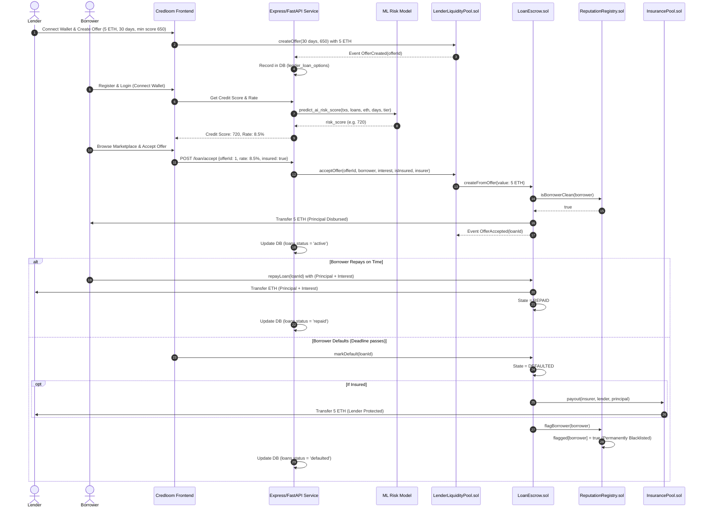

# CREDLOOM — Comprehensive Project Context & Technical Architecture

> **Decentralized, Privacy-Preserving, AI-Scored, Insured Micro-Lending Platform**  
> *Semester Capstone Project Documentation*

---

## Table of Contents

1. [Executive Summary & Project Vision](#1-executive-summary--project-vision)
2. [Problem Statement & Market Gap](#2-problem-statement--market-gap)
3. [The Credloom Solution & Core Value Proposition](#3-the-credloom-solution--core-value-proposition)
4. [Platform Roles & Tripartite Economic Model](#4-platform-roles--tripartite-economic-model)
5. [End-to-End System Architecture](#5-end-to-end-system-architecture)
6. [Subsystem Deep Dives](#6-subsystem-deep-dives)
   - 6.1 [Smart Contracts Layer (`blockchain/`)](#61-smart-contracts-layer-blockchain)
   - 6.2 [Blockchain Microservice (`blockchain-service/`)](#62-blockchain-microservice-blockchain-service)
   - 6.3 [Machine Learning Risk Engine (`mlModel/`)](#63-machine-learning-risk-engine-mlmodel)
   - 6.4 [Central Backend API & Authentication (`backend/`)](#64-central-backend-api--authentication-backend)
   - 6.5 [Frontend Web Application (`frontend/`)](#65-frontend-web-application-frontend)
7. [Database Schema & Entity-Relationship Architecture](#7-database-schema--entity-relationship-architecture)
8. [End-to-End User Workflows & Lifecycles](#8-end-to-end-user-workflows--lifecycles)
   - 8.1 [Borrower Onboarding & Verification](#81-borrower-onboarding--verification)
   - 8.2 [Lender Offer Creation & Escrow Pre-funding](#82-lender-offer-creation--escrow-pre-funding)
   - 8.3 [Loan Matching, Negotiation & Disbursal](#83-loan-matching-negotiation--disbursal)
   - 8.4 [Repayment Flow](#84-repayment-flow)
   - 8.5 [Default Handling, Insurance Payout & Reputation Slashing](#85-default-handling-insurance-payout--reputation-slashing)
9. [Verification Tier Hierarchy](#9-verification-tier-hierarchy)
10. [Interest Rate & Risk Scoring Formulas](#10-interest-rate--risk-scoring-formulas)
11. [Tech Stack Matrix](#11-tech-stack-matrix)
12. [Environment Configuration & Deployment Topology](#12-environment-configuration--deployment-topology)
13. [Current Implementation Status & Roadmap](#13-current-implementation-status--roadmap)

---

## 1. Executive Summary & Project Vision

**Credloom** is a decentralized peer-to-peer micro-lending protocol engineered to bridge the gap between traditional credit mechanisms and Web3 decentralized finance (DeFi). 

In today's cryptocurrency landscape, borrowing is virtually impossible without **over-collateralization** (often requiring 150% to 200% collateral in assets like ETH or USDC). This model inherently excludes unbanked populations, gig economy workers, early-stage Web3 builders, and everyday retail users seeking liquidity without holding locked crypto reserves.

Credloom pioneers a **reputation-first, under-collateralized lending framework** combining:
1. **Machine Learning Risk Assessment**: An on-chain and off-chain data-driven Gradient Boosting Regressor that computes dynamic creditworthiness scores ($0 - 1000$).
2. **Immutable On-Chain Reputation Registry**: A permanent, irreversible smart-contract registry flagging defaulters, effectively turning Web3 wallet identity and credit history into a non-fungible asset.
3. **Tripartite Risk Distribution**: Lenders provide liquidity, Borrowers receive capital, and independent Insurers stake underwriting capital in dedicated insurance pools to absorb default risks in exchange for yield premiums.
4. **Smart Contract Escrow & Settlement**: Fully autonomous funds custody, deadline enforcement, interest distribution, and automated default payouts without centralized intermediaries.

---

## 2. Problem Statement & Market Gap

| Traditional Banking / FinTech | Prevailing DeFi Protocols (Aave, Compound) | Credloom Paradigm |
| :--- | :--- | :--- |
| **High Barrier to Entry**: Requires centralized credit agency checks (CIBIL, FICO), geographic eligibility, and physical documentation. | **150%+ Over-Collateralization**: To borrow \$1,000, users must lock \$1,500+ in crypto. Capital inefficient. | **Under-Collateralized / Zero-Collateral**: Loans issued on reputation, tier status, and ML-calculated credit risk. |
| **Zero Privacy**: Requires extensive KYC, identity tracking, tax audits, and invasive financial surveillance. | **Pseudonymous but Inflexible**: Wallets are pseudonymous, but zero credit history or behavioral scoring is used. | **Privacy-Preserving Proofs**: Tiered verification (ENS, Gitcoin Passport) without exposing real-world identity on-chain. |
| **Centralized Rent-Seeking**: Banks extract wide margins between deposit APY and loan APR. | **Liquidation Cascades**: Volatile collateral leads to sudden automated market liquidations. | **Automated Escrow & Insurance Pools**: Fixed-term contracts with insurer safety nets protect lenders from volatility. |

---

## 3. The Credloom Solution & Core Value Proposition

Credloom solves these problems through four foundational pillars:

1. **Reputation as Collateral**: Instead of forcing users to lock digital assets, Credloom leverages the borrower's on-chain history and wallet identity. Defaulting permanently burns that wallet's ability to borrow across the protocol via `ReputationRegistry.sol`.
2. **AI-Driven Risk Scoring**: The platform analyzes transaction frequency, account age, historical borrowing track record, and verification tiers to generate an algorithmic credit score. Higher credit scores unlock lower interest rates and higher loan limits.
3. **Risk-Adjusted Dynamic Pricing**: Lenders define acceptable risk thresholds, and borrowers receive dynamic APRs (5% - 25%) directly proportional to their credit risk score.
4. **Insured Lending**: High-risk or institutional lenders can require insurance backing. Insurers underwrite loans by depositing into `InsurancePool.sol`, collecting premium yields (e.g., 100 bps / 1%), and automatically reimbursing the lender if the borrower defaults.

---

## 4. Platform Roles & Tripartite Economic Model

```
               ┌────────────────────────────────────────────────────────┐
               │                     CREDLOOM ECOSYSTEM                 │
               └────────────────────────────────────────────────────────┘
                                           │
         ┌─────────────────────────────────┼─────────────────────────────────┐
         ▼                                 ▼                                 ▼
┌──────────────────┐             ┌──────────────────┐             ┌──────────────────┐
│     BORROWER     │             │      LENDER      │             │     INSURER      │
├──────────────────┤             ├──────────────────┤             ├──────────────────┤
│ • Requests loan  │             │ • Pre-funds pool │             │ • Stakes capital │
│ • Provides tier  │             │ • Sets min score │             │   in Insurance   │
│   verification   │             │   & max duration │                 Pool           │
│ • Gets AI score  │             │ • Earns interest │             │ • Collects fee   │
│ • Repays debt +  │             │   yield (APR)    │                 premiums (bps) │
│   interest       │             │ • Capital insured│             │ • Absorbs loss   │
│ • Builds credit  │             │   against default│                 on default     │
└──────────────────┘             └──────────────────┘             └──────────────────┘
```

1. **Borrowers**:
   - Register account and bind Ethereum wallet.
   - Complete tiered verifications (Tier 1: Basic, Tier 2: ENS, Tier 3: Gitcoin Passport).
   - Receive AI-calculated credit score and tailored interest rates.
   - Borrow funds through smart-contract escrow and repay within the agreed deadline.
   - Build on-chain credit history or face permanent blacklisting upon default.

2. **Lenders**:
   - Deposit liquid ETH into `LenderLiquidityPool.sol`.
   - Configure lending risk policies: minimum borrower credit score, loan duration, and maximum amount.
   - Select optional insurance coverage requirements for safety.
   - Earn passive yield via principal + interest repayments.

3. **Insurers**:
   - Provide underwriting capital into `InsurancePool.sol`.
   - Earn premium percentages (e.g., 1% of principal) on every insured loan.
   - Liquidate staked capital to automatically reimburse lenders in the event of an unrecoverable borrower default.

---

## 5. End-to-End System Architecture

```
                                  ┌───────────────────────────────┐
                                  │      CLIENT BROWSER (UI)      │
                                  │   Next.js 16 + Tailwind CSS   │
                                  │    Borrower / Lender / Insurer │
                                  └──────────────┬────────────────┘
                                                 │
                         ┌───────────────────────┴───────────────────────┐
                         │                                               │
                         ▼                                               ▼
            ┌─────────────────────────┐                     ┌─────────────────────────┐
            │   NEXT.JS API PROXIES   │                     │      WEB3 / WALLET      │
            │  /api/proxy & /blockchain│                    │  Ethers.js / Wagmi / Viem│
            └────────────┬────────────┘                     └────────────┬────────────┘
                         │                                               │
         ┌───────────────┼───────────────┐                               │
         │               │               │                               │
         ▼               ▼               ▼                               │
┌─────────────────┐ ┌──────────┐ ┌─────────────────┐                     │
│   NODE/EXPRESS  │ │ ML MODEL │ │   BLOCKCHAIN    │                     │
│   BACKEND API   │ │ SERVICE  │ │     SERVICE     │                     │
│   (Port 3000)   │ │(Port 5000│ │  FastAPI/Web3.py│                     │
│  Auth, DB, Rates│ │GBR Risk) │ │   (Port 8000)   │                     │
└────────┬────────┘ └──────────┘ └────────┬────────┘                     │
         │                                │                              │
         ▼                                ▼                              ▼
┌─────────────────┐              ┌──────────────────────────────────────────────┐
│    SUPABASE     │              │             ETHEREUM BLOCKCHAIN              │
│   POSTGRESQL    │              │             (Hardhat / EVM Testnet)          │
│ Users, Profiles,│              ├──────────────────────────────────────────────┤
│ Credit, Loans,  │              │ • ReputationRegistry.sol (Blacklist)         │
│ Events, Liquidity│              │ • InsurancePool.sol     (Underwriting)       │
└─────────────────┘              │ • LoanEscrow.sol        (Loan State Machine) │
                                 │ • LenderLiquidityPool.sol (Pre-funded Offers)│
                                 └──────────────────────────────────────────────┘
```

---

## 6. Subsystem Deep Dives

### 6.1 Smart Contracts Layer (`blockchain/`)

Built with Solidity `^0.8.20` and orchestrated using **Hardhat**. The smart contract suite decouples custody, state execution, reputation tracking, and insurance reserves.

#### 1. `ReputationRegistry.sol`
- **Purpose**: Stores permanent, irreversible borrower default flags. Replaces physical or digital collateral with on-chain credit reputation.
- **Key State Variables**:
  - `mapping(address => bool) private flagged;`
  - `address public loanEscrowContract;`
- **Key Functions**:
  - `setLoanEscrowContract(address _loanEscrow)`: One-time configuration wiring.
  - `flagBorrower(address borrower)`: Permanently blacklists an address. Can only be invoked by `LoanEscrow`. Throws `BorrowerAlreadyFlagged` or `NotAuthorized`.
  - `isBorrowerClean(address borrower) view returns (bool)`: Returns `true` if never defaulted.
  - `isBorrowerFlagged(address borrower) view returns (bool)`: Verification check.

#### 2. `InsurancePool.sol`
- **Purpose**: Holds insurer capital and guarantees automated, trustless lender payouts upon borrower default.
- **Key State Variables**:
  - `mapping(address => uint256) private insurerBalance;`
  - `address public loanEscrowContract;`
- **Key Functions**:
  - `deposit() external payable`: Insurers pre-fund underwriting balance.
  - `payout(address insurer, address lender, uint256 amount) external`: Executed exclusively by `LoanEscrow`. Deducts insurer balance and transfers ETH directly to the lender.
  - `getInsurerBalance(address insurer) view returns (uint256)`: Read available reserves.

#### 3. `LoanEscrow.sol`
- **Purpose**: Core loan state machine that governs funded loans, tracks deadlines, releases escrowed capital to borrowers, accepts repayments, and triggers defaults.
- **States**: `enum LoanState { FUNDED, REPAID, DEFAULTED }`
- **Data Structure**:
  ```solidity
  struct Loan {
      address borrower;
      address lender;
      address insurer;
      uint256 principal;
      uint256 interest;
      uint256 duration;
      uint256 deadline;
      bool isInsured;
      LoanState state;
  }
  ```
- **Key Functions**:
  - `createFromOffer(...) external payable`: Callable strictly by `LenderLiquidityPool`. Validates `reputationRegistry.isBorrowerClean(borrower)`, records loan, sets deadline (`block.timestamp + duration`), and dispatches principal to borrower using `.call{value: principal}("")`.
  - `repayLoan(uint256 loanId) external payable`: Accepts `principal + interest`. Transfers full repayment amount to lender and updates state to `REPAID`. Open to third-party repayment recovery.
  - `markDefault(uint256 loanId) external`: Callable by anyone after `block.timestamp > loan.deadline`. Sets state to `DEFAULTED`, executes `insurancePool.payout()` within a `try/catch` safety block, and invokes `reputationRegistry.flagBorrower(loan.borrower)`.

#### 4. `LenderLiquidityPool.sol`
- **Purpose**: Pre-funding pool for lender capital. Allows lenders to deposit funds and configure loan parameters upfront.
- **Key Functions**:
  - `createOffer(uint256 duration, uint256 minCreditScore) external payable`: Lender deposits ETH and defines borrower criteria.
  - `withdrawOffer(uint256 offerId) external`: Allows lender to cancel an unaccepted offer and reclaim locked ETH.
  - `acceptOffer(uint256 offerId, address borrower, uint256 interest, bool isInsured, address insurer) external onlyProtocol`: Backend protocol signer executes the loan match, atomically forwarding the principal to `LoanEscrow.createFromOffer`.

---

### 6.2 Blockchain Microservice (`blockchain-service/`)

A high-performance Python FastAPI service providing a bridge between off-chain REST consumers and the Ethereum smart contracts.

- **Stack**: FastAPI, Uvicorn, Web3.py, python-dotenv, Supabase Python Client.
- **Operational Mode**: Dual-mode supporting **custodial testing** (20 pre-configured Hardhat demo keys) and **protocol-level signing** (`BACKEND_PRIVATE_KEY`).
- **Core Endpoints**:
  - `POST /lender/create-offer`: Signs and broadcasts `createOffer` transaction to `LenderLiquidityPool`, tracks offer ID, and creates an entry in Supabase `lender_loan_options`.
  - `GET /market/offers`: Retrieves all active loan offers from database and smart contract state.
  - `POST /loan/accept`: Computes interest in wei, executes protocol-level `acceptOffer`, captures blockchain event `OfferAccepted(offerId, loanId, borrower)`, and invokes `finalize_loan_acceptance` in Supabase.
  - `POST /loan/default/{loan_id}`: Triggers `LoanEscrow.markDefault(loan_id)`.
  - `GET /borrower/{address}/flagged`: Read-only call querying `ReputationRegistry.isBorrowerFlagged`.
  - `GET /balance/{address}`: Returns ETH and Wei balances for any target account.
  - `GET /system/contracts`: Exposes contract deployment addresses.

---

### 6.3 Machine Learning Risk Engine (`mlModel/`)

Credloom uses an algorithmic machine learning risk assessment model trained to evaluate the probability of borrower default based on wallet activity metrics.

- **Algorithm**: Gradient Boosting Regressor (GBR) saved in `best_gbr_risk_model_2.pkl` with feature schema in `feature_names_2.pkl`.
- **Feature Vector**:
  1. `total_transactions`: Lifetime wallet transaction count.
  2. `num_previous_loans`: Total number of prior loans serviced across platforms.
  3. `total_previous_loans_eth`: Volume of past debt denominated in ETH.
  4. `holding_days`: Wallet age or historical holding duration.
  5. `Tier`: Verification tier ($1, 2, \text{ or } 3$).
  6. `borrow_per_day` (Derived Feature): $\frac{\text{total\_previous\_loans\_eth}}{\max(\text{holding\_days}, 10^{-6})}$.
- **Risk Score Output Formula**:
  $$\text{risk\_raw} = \text{GBR.predict}(X) \in [0.0, 1.0]$$
  $$\text{ai\_risk\_score} = \text{int}((1.0 - \text{risk\_raw}) \times 1000) \in [0, 1000]$$
- Higher scores represent lower default risk (greater creditworthiness).

---

### 6.4 Central Backend API & Authentication (`backend/`)

A Node.js and Express microservice integrated with Supabase PostgreSQL, managing user accounts, authentication security, and interest rate derivations.

- **Stack**: Express.js, Supabase JS Client (`@supabase/supabase-js`), Bcrypt.js, JsonWebToken (JWT), CORS.
- **Authentication System**:
  - `POST /auth/register`:
    - Validates wallet regex (`^0x[a-fA-F0-9]{40}$`), username (min 3 chars), password (min 8 chars).
    - Hashes password using bcrypt with 10 salt rounds.
    - Atomically initializes `users`, `profiles`, and `credit_profiles` tables with default Tier 1 parameters (credit score 650, \$1000 borrow limit, \$500 loan limit, 30 days max duration, 7-day grace period).
  - `POST /auth/login`:
    - Validates credentials against `password_hash`.
    - Emits a signed JWT token with a 7-day expiry containing `user_id`, `username`, and `wallet`.
- **Interest Rate Engine (`POST /user/getrate/:wallet`)**:
  - Queries user's `credit_score` and `risk_state` from `credit_profiles`.
  - Rejects accounts flagged in `critical` risk state with HTTP 403.
  - Dynamically calculates annual interest rate percentage based on score tiers:
    - **Score $\ge 750$**: $5.0\% + \left(\frac{850 - \text{score}}{100}\right) \times 3.0\%$ (Range: $5.0\% - 8.0\%$)
    - **Score $650 - 749$**: $8.0\% + \left(\frac{750 - \text{score}}{100}\right) \times 4.0\%$ (Range: $8.0\% - 12.0\%$)
    - **Score $550 - 649$**: $12.0\% + \left(\frac{650 - \text{score}}{100}\right) \times 6.0\%$ (Range: $12.0\% - 18.0\%$)
    - **Score $< 550$**: $18.0\% + \left(\frac{550 - \text{score}}{100}\right) \times 7.0\%$ (Capped at $25.0\%$)

---

### 6.5 Frontend Web Application (`frontend/`)

Built on **Next.js 16 (App Router)** and **React 19**, styled with **Tailwind CSS v4** and animated using **Framer Motion**.

- **Design Aesthetic**: Premium Web3 dark-mode theme (`bg-zinc-950`, neon cyan-to-purple gradients, glassmorphism card surfaces, Lucide icons).
- **Client Architecture**:
  - `AuthContext.jsx`: Central authentication state machine managing login sessions, JWT storage in `localStorage`, user role resolution, and tier verification cache.
  - `client.js`: HTTP request client with automatic Bearer token injection and error wrapping.
  - `blockchain.js`: Direct client for the Python blockchain service with EIP-55 checksumming.
  - Next.js Proxy Routes:
    - `src/app/api/proxy/[...path]/route.js`: Server-side proxy routing traffic to backend services to eliminate CORS limitations.
    - `src/app/api/blockchain/[...path]/route.js`: Proxy routing requests to the EC2 blockchain microservice.
- **Portals & Dashboards**:
  - **Landing Page (`/`)**: Hero section, value propositions, feature showcases, FAQ accordion.
  - **Borrower Dashboard (`/borrower`)**: Credit score display, verification badges, active loan countdown clocks, repayment widgets, borrow request flow.
  - **Lender Dashboard (`/lender`)**: Deployed liquidity statistics, escrow balance, risk parameter configuration (min score, max duration), active yield metrics.
  - **Insurer Dashboard (`/insurer`)**: Staked underwriting capital, policy monitoring, earned premium metrics, risk ratio gauges.
  - **Sign Up / Sign In (`/signin`, `/signup-borrower`, `/signup-lender`, `/signup-insurer`)**: Role-customized onboarding flows.

---

## 7. Database Schema & Entity-Relationship Architecture

The persistent data layer is implemented in **PostgreSQL** via **Supabase**.

```
  ┌──────────────┐         1:1         ┌──────────────┐
  │    users     │─────────────────────│   profiles   │
  │--------------│                     │--------------│
  │ id (PK)      │                     │ id (PK)      │
  │ primary_wal..│                     │ user_id (FK) │
  │ username     │                     │ wallet       │
  │ password_hash│                     │ tier (1-3)   │
  │ status       │                     └──────────────┘
  └──────┬───────┘                            │
         │                                    │ 1:1
         │ 1:N                                ▼
         │                             ┌──────────────┐
         │                             │credit_profile│
         │                             │--------------│
         │                             │ wallet (UQ)  │
         │                             │ credit_score │
         │                             │ risk_state   │
         │                             │ max_borrow   │
         │                             └──────────────┘
         ▼
  ┌──────────────┐         1:N         ┌──────────────┐
  │ lender_opts  │─────────────────────│    loans     │
  │--------------│                     │--------------│
  │ id (PK)      │                     │ id (PK)      │
  │ chain_offer_id                     │ loan_id (UQ) │
  │ lender_wallet│                     │ borrower_id  │
  │ amount_avail │                     │ lender_id    │
  │ min_score    │                     │ principal    │
  │ duration_days│                     │ interest_amt │
  │ active       │                     │ status       │
  └──────────────┘                     │ tx_create_h. │
                                       └──────────────┘
```

### Table Definitions

1. **`users`**: Master authentication records.
   - `id`: Primary key (Serial).
   - `primary_wallet`: Unique Ethereum address.
   - `username`: Unique handle.
   - `password_hash`: Bcrypt hashed password.
   - `status`: Account state (`active`, `suspended`).

2. **`profiles`**: Extended user KYC and profile state.
   - `wallet`: Unique wallet address.
   - `user_id`: Foreign key reference to `users.id`.
   - `tier`: Verification level (1, 2, or 3).
   - `total_transactions`, `num_previous_loans`, `total_previous_loans_eth`: Behavioral counters.

3. **`credit_profiles`**: Risk engine and credit management data.
   - `wallet`: Unique wallet address.
   - `credit_score`: Score integer ($0 - 850$).
   - `risk_points`: Accumulated risk infractions.
   - `risk_state`: `healthy`, `warning`, or `critical`.
   - `max_borrow_amount`: Dynamic ceiling based on tier and score.
   - `available_credit`, `utilization_rate`: Real-time exposure limits.

4. **`lender_loan_options`**: On-chain liquidity proposals.
   - `id`: Internal primary key.
   - `chain_offer_id`: Matches `offerId` in `LenderLiquidityPool.sol`.
   - `lender_wallet`: Depositor address.
   - `amount_available`: Deposited ETH amount.
   - `duration_days`: Lock duration.
   - `min_score`: Credit threshold required to take offer.
   - `active`: Boolean flag indicating if offer is open.

5. **`loans`**: Comprehensive record of instantiated loans.
   - `id`: Internal serial PK.
   - `loan_id`: Unique loan string / blockchain loan index.
   - `blockchain_loan_id`: Integer ID from `LoanEscrow.sol`.
   - `borrower_wallet`, `lender_wallet`, `insurer_wallet`: Participant addresses.
   - `principal`, `interest_amount`, `insurance_premium`: Financial amounts.
   - `apr_bps`, `premium_bps`: Interest and insurance rates in basis points.
   - `status`: Current state (`selected`, `active`, `repaid`, `defaulted`).
   - `start_ts`, `due_ts`, `grace_end_ts`: Timestamps.
   - `tx_create_hash`, `tx_repay_hash`, `tx_default_hash`: Blockchain transaction proofs.

6. **`defaults_registry`**: Immutable log of defaults for auditing.
   - Records `wallet`, `loan_id`, `principal`, `tx_hash`, and resolution status.

---

## 8. End-to-End User Workflows & Lifecycles



### Step-by-Step Breakdown

1. **Offer Creation**: A lender deposits funds into `LenderLiquidityPool.sol` via `createOffer()`. The transaction locks ETH in escrow and creates an open offer with explicit duration and credit score constraints.
2. **Borrower Evaluation**: When a borrower requests a loan, the ML service analyzes their historical features and outputs their `ai_risk_score`. The backend calculates their dynamic interest rate (e.g., 8.5%).
3. **Loan Acceptance**: The borrower accepts an offer via `/loan/accept`. The protocol verifies that the borrower is not flagged in `ReputationRegistry.sol`. The principal is transferred immediately from the pool through `LoanEscrow.sol` to the borrower's wallet.
4. **Repayment Scenario**: The borrower repays the total amount (`principal + interest`) to `LoanEscrow.sol` before the deadline. The contract forwards all funds to the lender and updates the loan state to `REPAID`.
5. **Default Scenario**: If the deadline passes without repayment, `markDefault()` is called. 
   - The borrower's wallet is permanently flagged in `ReputationRegistry.sol`, preventing them from ever taking another loan on Credloom.
   - If the loan was insured, `InsurancePool.sol` automatically executes a payout to reimburse the lender's principal.

---

## 9. Verification Tier Hierarchy

Credloom implements a three-tier progressive verification hierarchy that balances privacy and risk.

| Tier Level | Verification Method | Privacy Level | Max Borrow Capacity | Max Single Loan | Max Duration |
| :---: | :--- | :--- | :---: | :---: | :---: |
| **Tier 1 (Basic)** | Wallet Connection & Signature Only | 100% Pseudonymous | \$1,000 | \$500 | 30 Days |
| **Tier 2 (ENS Verified)** | Verified Ethereum Name Service (ENS) Domain Ownership | High (Pseudonymous Web3 Identity) | \$5,000 | \$2,500 | 60 Days |
| **Tier 3 (Proof of Humanity)**| Gitcoin Passport / Biometric / KYC Credential | Balanced (Sybil-Resistant Identity) | \$10,000 | \$5,000 | 90+ Days |

---

## 10. Interest Rate & Risk Scoring Formulas

### ML Risk Prediction
The Gradient Boosting Regressor computes the raw default risk probability:
$$\text{risk\_raw} = f(\text{txs}, \text{prev\_loans}, \text{loan\_eth}, \text{holding\_days}, \text{Tier}) \in [0, 1]$$
The platform credit score is derived as:
$$\text{AI Credit Score} = \lfloor (1.0 - \text{risk\_raw}) \times 1000 \rfloor$$

### Dynamic APR Derivation
Based on the credit score $S \in [300, 850]$, the annual interest rate $R(S)$ is:

$$R(S) = \begin{cases} 
5.0 + \left(\frac{850 - S}{100}\right) \times 3.0 & \text{if } S \ge 750 \\
8.0 + \left(\frac{750 - S}{100}\right) \times 4.0 & \text{if } 650 \le S < 750 \\
12.0 + \left(\frac{650 - S}{100}\right) \times 6.0 & \text{if } 550 \le S < 650 \\
\min\left(18.0 + \left(\frac{550 - S}{100}\right) \times 7.0, \, 25.0\right) & \text{if } S < 550 
\end{cases}$$

### Loan Interest & Insurance Calculation
For a loan with principal $P$ in ETH, annual interest rate percentage $R$, duration in days $D$, and insurance premium in basis points $B_{ins}$:

$$\text{Interest Amount (ETH)} = P \times \left(\frac{R}{100}\right) \times \left(\frac{D}{365}\right)$$
$$\text{Total Repayment (ETH)} = P + \text{Interest Amount}$$
$$\text{Insurance Premium (ETH)} = P \times \left(\frac{B_{ins}}{10000}\right) \quad (\text{typically } 1\% \text{ or } 100 \text{ bps})$$

---

## 11. Tech Stack Matrix

| Component | Technology | Version / Library | Purpose |
| :--- | :--- | :--- | :--- |
| **Smart Contracts** | Solidity | `^0.8.20` / `0.8.28` | Autonomous escrow, registry, liquidity pools |
| **Blockchain Toolchain**| Hardhat | `^2.22.3`, Hardhat Toolbox | Contract compilation, testing, deployment |
| **Blockchain Service** | Python / FastAPI | Python 3.10+, Web3.py, Uvicorn | Blockchain RPC adapter, custodial signing |
| **Risk / ML Engine** | Python / Scikit-Learn | Joblib, Pandas, NumPy, GBR | Predictive default risk scoring |
| **Backend API** | Node.js / Express | Node 18+, Express 5, JWT, Bcrypt | User authentication, interest calculation |
| **Database** | Supabase (PostgreSQL)| `@supabase/supabase-js` | Relational data persistence, state sync |
| **Frontend Framework** | Next.js | Next.js 16 (App Router) | Client application and server-side proxies |
| **Frontend UI Library** | React | React 19, Radix UI primitives | Component tree and reactive state |
| **Styling & Animation** | Tailwind CSS / Framer | Tailwind CSS v4, Framer Motion | Cyberpunk dark-mode styling, animations |
| **Web3 Client** | Ethers.js | Ethers v6 | Client-side wallet interaction & formatting |

---

## 12. Environment Configuration & Deployment Topology

### Network Topology

```
┌─────────────────────────────────────────────────────────────┐
│                       AWS CLOUD (EC2)                       │
│  Public IP: 13.203.55.241                                   │
│                                                             │
│  ┌────────────────────────┐     ┌────────────────────────┐  │
│  │   BLOCKCHAIN SERVICE   │     │      HARDHAT NODE      │  │
│  │    FastAPI (Port 8000) │◄───►│       (Port 8545)      │  │
│  └────────────────────────┘     └────────────────────────┘  │
└──────────────────────────────▲──────────────────────────────┘
                               │
            HTTP API Calls     │   Contract Events & RPC
                               │
┌──────────────────────────────┴──────────────────────────────┐
│                      LOCAL / HYBRID DEV                     │
│                                                             │
│  ┌────────────────────────┐     ┌────────────────────────┐  │
│  │    NEXT.JS FRONTEND    │     │    EXPRESS BACKEND     │  │
│  │       (Port 3000)      │◄───►│       (Port 3001)      │  │
│  └────────────────────────┘     └───────────┬────────────┘  │
│                                             │               │
│                                             ▼               │
│                                 ┌────────────────────────┐  │
│                                 │   SUPABASE DATABASE    │  │
│                                 │      (PostgreSQL)      │  │
│                                 └────────────────────────┘  │
└─────────────────────────────────────────────────────────────┘
```

### Essential Environment Variables

#### `blockchain-service/.env`:
```ini
RPC_URL=http://127.0.0.1:8545
CHAIN_ID=31337
BACKEND_PRIVATE_KEY=0xac0974bec39a17e36ba4a6b4d238ff944bacb478cbed5efcae784d7bf4f2ff80
LOAN_ESCROW_ADDRESS=0x...
REPUTATION_REGISTRY_ADDRESS=0x...
INSURANCE_POOL_ADDRESS=0x...
LIQUIDITY_POOL_ADDRESS=0x...
SUPABASE_URL=https://<project-id>.supabase.co
SUPABASE_SERVICE_ROLE_KEY=ey...
```

#### `backend/.env`:
```ini
PORT=3000
SUPABASE_URL=https://<project-id>.supabase.co
SUPABASE_SERVICE_ROLE_KEY=ey...
JWT_SECRET=your-secret-key-change-in-production
```

#### `frontend/.env.local`:
```ini
NEXT_PUBLIC_API_URL=http://localhost:3000
BACKEND_API_URL=http://localhost:3000
NEXT_PUBLIC_INTEREST_RATE_API=http://localhost:3000
```

---

## 13. Current Implementation Status & Roadmap

### What is Completed:
- [x] **Smart Contracts Core**: Complete Solidity implementation of `ReputationRegistry`, `InsurancePool`, `LoanEscrow`, and `LenderLiquidityPool`. All inter-contract wiring and permissions verified.
- [x] **Hardhat Deployment Scripts**: Automated deployment and permission-wiring script (`deploy.js`).
- [x] **Blockchain Microservice**: FastAPI server on EC2 with endpoints for creating offers, accepting loans, triggering defaults, reading flags, and checking balances.
- [x] **Database Schema**: Comprehensive Supabase PostgreSQL tables created for user accounts, profiles, credit profiles, loan proposals, and active loans.
- [x] **Authentication Engine**: Express backend with bcrypt password hashing, JWT creation, and role-based signup flows.
- [x] **Dynamic Interest Engine**: Algorithm computing tiered interest rates from credit scores.
- [x] **Machine Learning Model**: Trained Gradient Boosting Regressor predicting default risk and computing 0-1000 credit scores.
- [x] **Frontend Shell**: Next.js 16 landing page, borrower portal, lender portal, insurer dashboard, and signup/signin forms.
- [x] **API Proxy Routing**: Next.js API route proxies to bypass browser CORS constraints.

### Next Roadmap Milestones:
- [ ] **Direct Wallet Provider Integration**: Add Wagmi/Viem connector modal (RainbowKit) for real-time MetaMask/Coinbase wallet transactions alongside custodial demo mode.
- [ ] **Live Oracle Integration**: Chainlink price feeds to peg loan amounts to USD while disbursing in ETH.
- [ ] **Full Repayment UI Flow**: Add in-browser transaction execution for the borrower's `repayLoan()` action with live transaction hash toasts.
- [ ] **Real Gitcoin Passport API Hooks**: Connect Tier 3 verification form directly to Gitcoin Passport Scorer API.
- [ ] **Automated Default Cron Job**: Background worker to periodically query expired loans on-chain and trigger automated defaults.

---

*Document compiled for the Credloom Semester Project repository. All rights reserved.*
